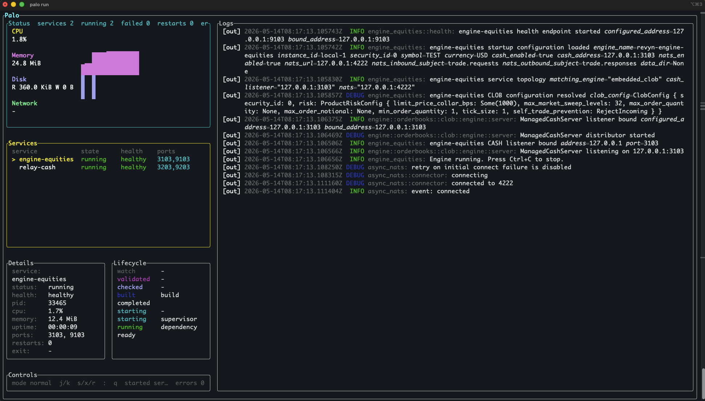

# Palo

Palo is a local process manager for multi-service development environments.

It gives you a Docker Compose-like control plane without containers: define your
services in `palo.yml`, start them from one terminal dashboard, watch logs and
telemetry, restart on file changes, coordinate dependencies, and operate the
stack from a TUI or an optional MCP server.

Palo is built for source-first workflows where services run directly from your
local checkout with your normal toolchains.



## Features

- Declarative `palo.yml` service configuration.
- Generic process support for any command or executable.
- Rust project discovery with `palo init --type rust`.
- Dependency-aware startup and shutdown.
- Managed process lifecycle: start, stop, restart, crash handling, and shutdown.
- Build and check pipelines before service startup.
- Lifecycle hooks for build, start, and stop phases.
- HTTP health checks and command-based readiness checks.
- File watching with include, exclude, ignore paths, regex ignores, and debounce.
- Restart policies: `manual`, `mcp`, `never`, `change`, `crash`, and `always`.
- Per-service environment variables and working directories.
- Live stdout/stderr capture in the terminal UI.
- Runtime telemetry for CPU, memory, uptime, open ports, and platform-supported
  disk/network counters.
- File logging for Palo runtime logs and managed application logs.
- Optional MCP control server for tool/agent integrations.
- Structured internal logging with `tracing`.

## Status

Palo is early software. The repository already contains the core runtime,
configuration loader, Rust discovery, TUI, tests, examples, and MCP integration,
but the public package may not be published yet. Install from a checkout today;
use the crates.io command after the package is released.

## Install

### From Source

```sh
git clone <repository-url>
cd palo
cargo install --path palo
```

The repository root is a Cargo workspace, so install the binary crate from
`palo/`.

### From crates.io

```sh
cargo install palo
```

## Quick Start

Generate a configuration for a Rust workspace:

```sh
cd my-rust-workspace
palo init --type rust
palo run
```

Or create a commented template for any project:

```sh
palo new --template
$EDITOR palo.yml
palo run
```

Run with a custom config path:

```sh
palo run --config ./infra/palo.yml
```

## CLI

```text
palo init [--type rust|generic] [--overwrite]
palo new --template [--overwrite]
palo run [--config path]
```

`palo init` generates `palo.yml` from the current workspace. When `--type` is
omitted, Palo detects Rust projects by looking for `Cargo.toml`; otherwise it
falls back to generic mode. Existing configs are not overwritten unless
`--overwrite` is provided.

`palo new --template` writes a larger commented `palo.yml` template that shows
the available configuration fields.

`palo run` loads `palo.yml`, starts services with `autostart: true`, opens the
TUI, captures logs, and stops managed services before exit.

## TUI Controls

| Key | Action |
| --- | --- |
| `j` / Down | Select next service |
| `k` / Up | Select previous service |
| Tab / Right / `l` | Move focus forward |
| Shift+Tab / Left / `h` | Move focus backward |
| `s` | Start selected service |
| `x` | Stop selected service |
| `r` | Restart selected service |
| `S` | Start all services |
| `X` | Stop all services |
| `R` | Restart all services |
| `:` | Open command mode |
| `q` / Ctrl+C | Quit |

Command mode accepts:

```text
start
stop
restart
start all
stop all
restart all
quit
```

Mouse selection is supported in the service list.

## Minimal Configuration

```yaml
services:
  api:
    command: ["cargo", "run", "--package", "api"]
```

By default, services use:

- `type: generic`
- `autostart: true`
- `working_dir: .`
- `restart.on: manual`
- in-memory log retention of `500` lines

## Generic Example

```yaml
palo:
  settings:
    log_retention: 500
    telemetry_refresh: 1s
    logs:
      enabled: true
      directory: .palo/logs
      palo: true
      apps: true

services:
  web:
    type: generic
    autostart: true
    command: ["npm", "run", "dev"]
    working_dir: web
    env:
      NODE_ENV: development
      PORT: "3000"
    healthcheck:
      url: http://127.0.0.1:3000/health
      interval: 2s
      timeout: 1s
      retries: 30
    restart:
      on: change
    watch:
      paths:
        - web
      include:
        - "src/**"
        - "package.json"
      exclude:
        - "node_modules/**"
      ignore_paths:
        - web/.next
      debounce: 500ms

  worker:
    type: generic
    autostart: false
    command: ["./scripts/run-worker"]
    working_dir: .
    restart:
      on: crash
      max_crash_retries: 3
      backoff: 1s
```

## Rust Workspace Example

```yaml
palo:
  settings:
    log_retention: 500
    logs:
      enabled: true
      directory: .palo/logs
      palo: true
      apps: true

services:
  api:
    type: rust
    autostart: true
    target: debug
    executable: ["target/debug/api"]
    working_dir: .
    env:
      RUST_LOG: info
    build:
      check: ["cargo", "check", "--package", "api", "--bin", "api"]
      cmd: ["cargo", "build", "--package", "api", "--bin", "api"]
    healthcheck:
      http:
        url: http://127.0.0.1:8080/health
        method: GET
        expected_status: 200..399
      initial_delay: 1s
      interval: 5s
      timeout: 2s
      retries: 30
    restart:
      on: change
      debounce: 2500ms
    watch:
      paths:
        - .
      include:
        - "src/**/*.rs"
        - "Cargo.toml"
      exclude:
        - "target/**"
      ignore_paths:
        - ".palo"
```

`palo init --type rust` discovers workspace members, runnable binary targets,
Cargo check/build commands, debug executable paths, and useful watch paths. If a
package has multiple binaries, set `package.default-run` in `Cargo.toml` or edit
the generated service manually.

## Full Template

Use the built-in template when starting from scratch:

```sh
palo new --template
```

It writes a commented `palo.yml` with examples for:

- global settings
- file logging
- MCP settings
- Rust and generic services
- health checks
- legacy command readiness
- dependencies
- restart policies
- watch rules
- hooks

## Configuration Reference

### Global Settings

```yaml
palo:
  settings:
    font_size: 14
    log_retention: 500
    telemetry_refresh: 1s
    logs:
      enabled: true
      directory: .palo/logs
      palo: true
      apps: true
```

`font_size` is an optional UI hint for clients that support it.

`log_retention` sets the default number of in-memory log lines retained per
service.

`telemetry_refresh` is accepted as an optional refresh hint. Durations can be
human-readable strings such as `500ms`, `1s`, or `2m`. Integer duration values
are interpreted as milliseconds.

`logs` can be either a boolean or an object. When enabled, Palo writes each run
under `.palo/logs` by default and can capture Palo runtime logs and application
stdout/stderr separately.

### Services

```yaml
services:
  api:
    type: rust
    autostart: true
    target: debug
    command: ["cargo", "run", "--package", "api"]
    working_dir: .
```

Each service must define exactly one of `command` or `executable`.

`command` and `executable` accept either a shell-like string:

```yaml
command: "cargo run --package api"
```

or an argument array:

```yaml
command: ["cargo", "run", "--package", "api"]
```

Argument arrays are recommended because they avoid shell quoting surprises.

Supported service types:

- `generic`
- `rust`

Supported targets:

- `debug`
- `release`

### Environment

```yaml
services:
  api:
    command: ["cargo", "run", "--package", "api"]
    env:
      RUST_LOG: info
      API_BIND: 127.0.0.1:8080
```

Environment variables are applied to run commands, build commands, readiness
checks, and hooks for the service.

### Build Pipeline

```yaml
services:
  api:
    command: ["target/debug/api"]
    build:
      check: ["cargo", "check", "--package", "api", "--bin", "api"]
      cmd: ["cargo", "build", "--package", "api", "--bin", "api"]
```

When a service starts, Palo can run:

1. `hooks.pre_build`
2. `build.check`
3. `build.cmd`
4. `hooks.post_build`
5. the service command
6. `hooks.post_start`

### Health Checks

```yaml
services:
  api:
    command: ["target/debug/api"]
    healthcheck:
      http:
        url: http://127.0.0.1:8080/health
        method: GET
        expected_status: 200..399
      initial_delay: 1s
      interval: 1s
      timeout: 2s
      retries: 30
```

Short form is also supported:

```yaml
healthcheck:
  url: http://127.0.0.1:8080/health
```

`expected_status` can be a single code such as `200` or a range such as
`200..399`.

### Command Readiness

```yaml
services:
  worker:
    command: ["./worker"]
    readiness:
      command: ["sh", "-c", "test -f .palo/worker-ready"]
      initial_delay: 500ms
      interval: 1s
      timeout: 2s
      retries: 10
```

`readiness` is a command-based readiness check. Do not configure both
`readiness` and `healthcheck` on the same service.

### Dependencies

Short form:

```yaml
services:
  api:
    command: ["./api"]
    depends_on: [db]

  db:
    command: ["postgres", "-D", "data/postgres"]
```

Detailed form:

```yaml
services:
  api:
    command: ["./api"]
    depends_on:
      db:
        condition: ready
        restart: true
        required: true
        timeout: 60s
```

Dependency conditions:

- `started`
- `running`
- `ready`

Palo validates missing required dependencies, duplicate dependencies, self
dependencies, and dependency cycles before runtime starts.

### Restart Policies

```yaml
restart:
  on: manual
```

Supported policies:

| Policy | Behavior |
| --- | --- |
| `manual` | Restart only from the UI or command surface |
| `mcp` | Intended for MCP-controlled services; does not enable watching by default |
| `never` | Never restart automatically |
| `change` | Restart on matching file changes |
| `crash` | Restart after unexpected process exits |
| `always` | Restart whenever the process exits |

`change` accepts `debounce`:

```yaml
restart:
  on: change
  debounce: 500ms
```

`crash` accepts `max_crash_retries` and `backoff`:

```yaml
restart:
  on: crash
  max_crash_retries: 3
  backoff: 1s
```

`always` accepts `backoff`.

### File Watching

```yaml
watch:
  enabled: true
  paths:
    - .
  include:
    - "src/**/*.rs"
    - "Cargo.toml"
  exclude:
    - "target/**"
  ignore_paths:
    - ".palo"
  ignore_regex:
    - "(^|/)generated/"
  debounce: 500ms
```

For `restart.on: change`, watching is enabled by default and the default watch
path is the service `working_dir`. For other restart policies, watching is off
unless `watch.enabled: true` is set.

### Hooks

```yaml
hooks:
  pre_build:
    - ["cargo", "fmt", "--check"]
  post_build:
    - ["cargo", "test", "--package", "api", "--no-run"]
  pre_start:
    - ["sh", "-c", "echo starting api"]
  post_start:
    - ["sh", "-c", "echo api started"]
  pre_stop:
    - ["sh", "-c", "echo stopping api"]
  post_stop:
    - ["sh", "-c", "echo api stopped"]
```

Hook phases:

- `pre_build`
- `post_build`
- `pre_start`
- `post_start`
- `pre_stop`
- `post_stop`

Hooks inherit the service environment and working directory.

## MCP Server

Palo can expose an MCP server for local tool and agent integrations.

```yaml
palo:
  mcp:
    enabled: true
    host: 127.0.0.1
    port: 9464
    path: /mcp
    allowed_hosts: [localhost, 127.0.0.1, "::1"]
    allowed_origins: []
    stateful: true
    json_response: false
    log_retention: 512
```

When enabled, `palo run` starts the server next to the TUI. Available MCP tools
include:

- `runtime_status`
- `list_services`
- `get_service`
- `list_processes`
- `start_service`
- `stop_service`
- `restart_service`
- `check_service`
- `build_service`
- `start_all_services`
- `stop_all_services`
- `restart_all_services`
- `check_all_services`
- `build_all_services`
- `show_logs`

Keep MCP bound to localhost unless you have a deliberate reason to expose it.

## Logs and Telemetry

Palo keeps recent logs in memory for the TUI and can also write logs to disk.
The default file log directory is:

```text
.palo/logs
```

The TUI shows:

- service lifecycle state
- service health
- recent stdout/stderr
- restart reasons
- last exit code
- last error
- PID
- CPU usage
- memory usage
- uptime
- open ports
- disk and network counters when available

Network telemetry is built per platform: macOS samples process traffic with
`nettop`, Linux reads process network namespace counters, and Windows or other
unsupported targets report it as unavailable rather than mixing in host-wide
traffic.

Internal runtime events use `tracing`, so you can adjust verbosity with
`RUST_LOG`:

```sh
RUST_LOG=debug,palo=debug,palo_core=debug,palo_tui=info palo run
```

## Workspace Layout

```text
palo-core/   Core config, domain model, execution, orchestration, events, watch, telemetry
palo/        CLI binary, runtime wiring, logging, MCP server
projects/    Project discovery adapters, including Rust workspace discovery
tui/         Ratatui dashboard and terminal event handling
examples/    Example palo.yml files
```

## Development

Prerequisites:

- Rust toolchain with edition 2024 support.
- Cargo.
- Platform tools needed by the services you want Palo to run.

Clone and test:

```sh
git clone <repository-url>
cd palo
cargo test --workspace
```

Run the CLI from the workspace:

```sh
cargo run -p palo -- --help
cargo run -p palo -- new --template --overwrite
cargo run -p palo -- run
```

Run a specific test package:

```sh
cargo test -p palo-core
cargo test -p palo-projects
cargo test -p palo-tui
cargo test -p palo
```

Check formatting and linting before submitting changes:

```sh
cargo fmt --all -- --check
cargo clippy --workspace --all-targets -- -D warnings
cargo test --workspace
```

## Releasing

Releases are created by the GitHub Actions release workflow. The workflow runs
only when a version tag is pushed, and the tag must match the workspace package
version exactly.

Before releasing, update the workspace version in `Cargo.toml` and any internal
workspace dependency versions in member manifests, then validate the release
locally:

```sh
cargo package -p palo-core
cargo package -p palo-projects
cargo package -p palo-tui
cargo package -p palo
cargo test --workspace
```

Create and push the matching version tag:

```sh
git tag v0.5.1
git push origin v0.5.1
```

Replace `0.5.1` with the new version. On a successful tag build, GitHub Actions
builds release binaries, publishes the crates to crates.io in dependency order,
and creates the GitHub release with packaged assets.

The repository must have a crates.io token configured as either
`CARGO_REGISTRY_TOKEN` or `CRATES_IO_TOKEN` in GitHub Actions secrets. The
workflow also supports manual dispatch with an existing tag.

## Examples

Example configs live in `examples/`:

- `examples/palo.generic.yml`
- `examples/palo.rust.yml`
- `examples/palo.mcp.yml`

Copy one into a project as `palo.yml` and adjust service commands, ports, paths,
and environment variables.

## License

MIT. See [LICENSE](LICENSE).
